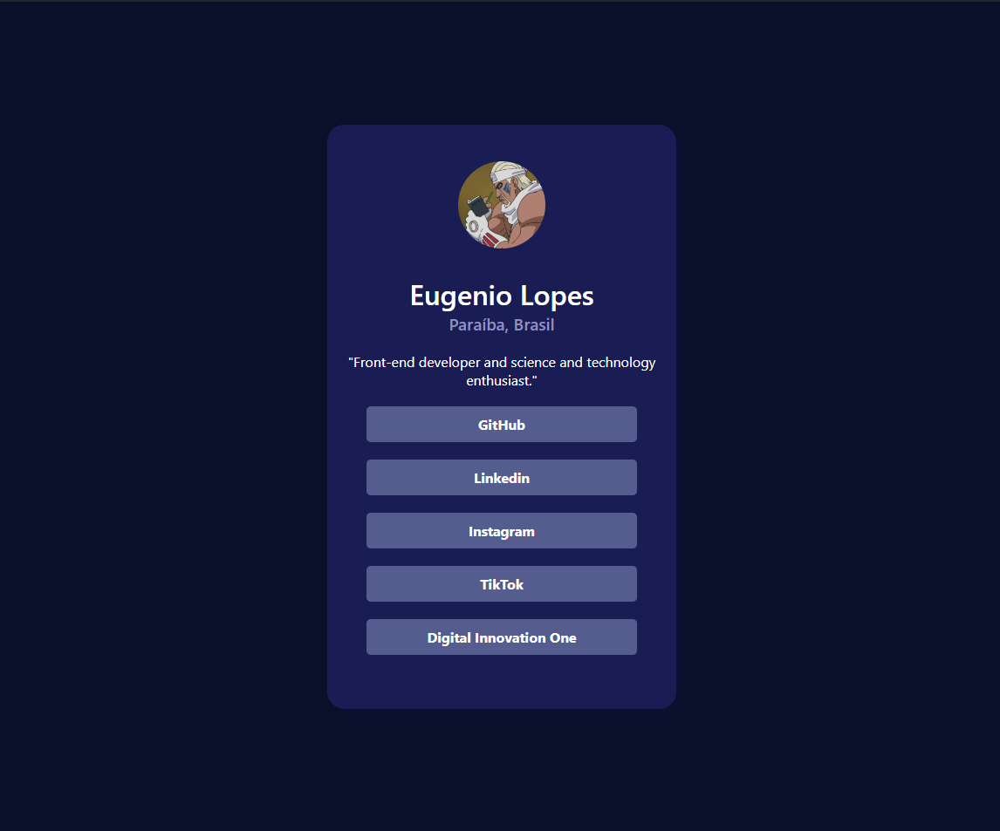

# Página de links
"link pages" é um projeto simples proposto pela [Frontend Mentor]('https://www.frontendmentor.io/challenges'), com o intuito de melhorar minhas habilidade com HTML e CSS.
- Link de acesso: 

## Tecnologias
- HTML5
- CSS3

## Estrutura do projeto

- `index.html`: Página principal do site
- `css/`: Pasta contendo a estilização do projeto
- `images/`: Pasta contendo a foto única do site